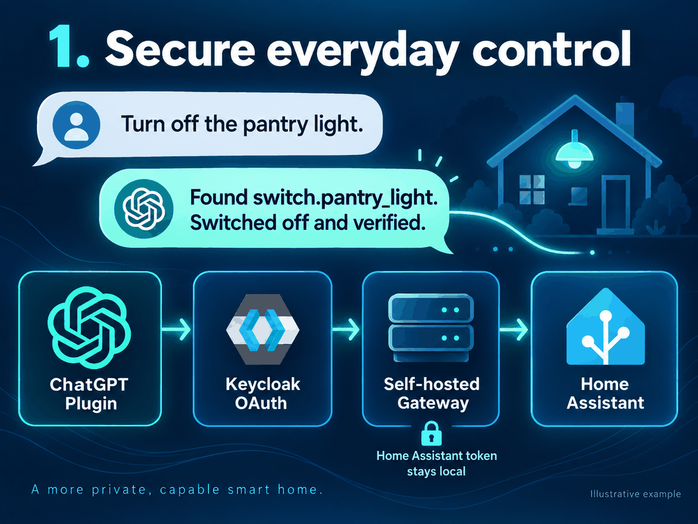
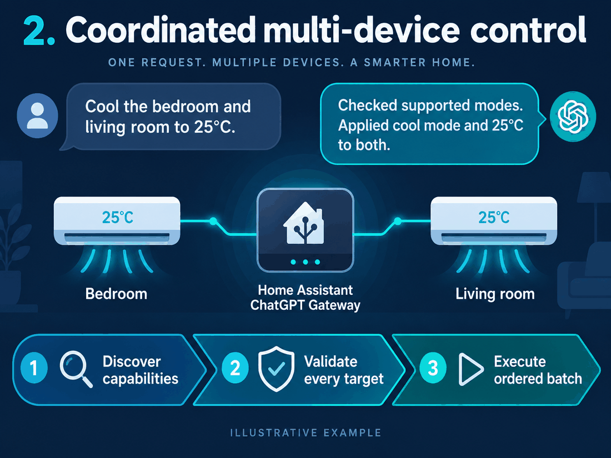
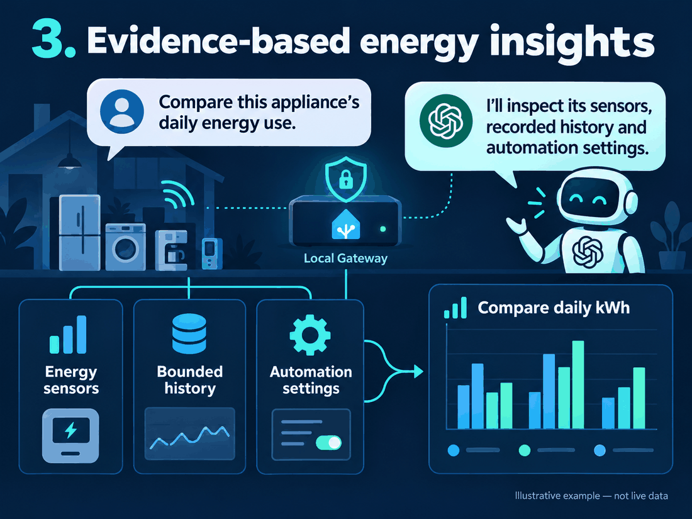

# Home Assistant ChatGPT Gateway Plugin


**An open-source, self-hosted gateway for discovering, monitoring and controlling Home Assistant from a personal ChatGPT plugin. No OpenAI API key required.**

Run it on a NAS, mini PC, Raspberry Pi, Linux server or other Docker host. ChatGPT connects through HTTPS and Keycloak OAuth; the gateway applies explicit policy before communicating with Home Assistant.

**The Home Assistant token stays exclusively on your gateway host.** It is never entered into ChatGPT, the plugin manifest or an MCP request. Tool results are sent to ChatGPT for inference: self-hosting the gateway does not make the model local.

## Breaking change: v0.6.0 → v0.7.0

The main integration changes from **custom GPT + OpenAPI Action + gateway API key** to **personal plugin + MCP + Keycloak OAuth**. Existing GPT Actions, their API keys and their OpenAPI schema do not become a plugin automatically.

- New plugin installations use Keycloak and the `/mcp` endpoint.
- The supplied environment example uses `ENABLE_LEGACY_REST_API=false`. In that mode `/api/v1/*` and `/openapi.json` are absent; gateway API keys are unnecessary.
- Existing REST installations remain compatible when `ENABLE_LEGACY_REST_API=true`, which is the runtime default for older environment files. REST still requires strong, distinct API keys.
- Migrate instructions into the supplied skill, create the MCP connection, authenticate, and test before retiring an Action or revoking its credentials.
- Keep the Keycloak database volume: deleting it loses users, clients and sessions.

OpenAI schedules custom GPT retirement for **December 11, 2026**, with **February 11, 2027** only for eligible Enterprise workspaces with approved deferral. Follow account-specific notices and the [official OpenAI FAQ](https://help.openai.com/en/articles/20001519-custom-gpt-retirement-and-migration-faq).

See the [migration and Keycloak guide](docs/plugin-migration.md).

## Architecture

```text
ChatGPT plugin ── login + PKCE ──> Keycloak + PostgreSQL
      |
      | HTTPS + short-lived OAuth access token
      v
Self-hosted gateway ── policy enforcement ──> Home Assistant on the LAN
      |
      └── Home Assistant token remains on this host
```

Keycloak authenticates the user; it is not a transparent proxy for Home Assistant traffic. Subsequent MCP tool calls go directly to the gateway.

## What it can do

- Discover permitted entities, states, devices and areas.
- Find live Home Assistant services and their parameter contracts.
- Control explicit single or multiple entities with structured parameters.
- Validate an entire ordered batch before the first write.
- Read bounded sensor history and redacted automation configuration.
- Dispatch long automations/scripts asynchronously and check their status.
- Offer opt-in, allowlisted administration and optional diagnostics/logbook.
- Enforce read/write roles, read-only mode, domain/entity policy, target resolution and rate limits.
- Retain optional REST/OpenAPI compatibility for existing clients.

Services remain generic and are discovered from Home Assistant. Actual capabilities depend on the integration, entity and policy; unsupported/global targets remain blocked.

## Illustrative workflows

These are stylized English examples, not screenshots or measurements from a real home.

### 1. Secure everyday control

[](assets/plugin-flow-control.png)

Login is handled by Keycloak; the Home Assistant credential remains local. Lamps represented as switches can be discovered too.

### 2. Coordinated multi-device control

[](assets/plugin-flow-batch.png)

Discover each device's supported modes before applying compatible parameters. A batch stops on failure and cannot roll back already completed Home Assistant operations.

### 3. Evidence-based energy insights

[](assets/plugin-flow-energy.png)

Compare actual recorded kWh across comparable periods. Missing or sampled data must be disclosed; the illustrations contain no live data or energy recommendation.

## Install with Docker Compose

Requires Docker Engine 24+, Compose 2.20+ and a ChatGPT account that permits custom MCP plugins. Images support amd64 and arm64.

```sh
git clone https://github.com/aferende/ha-chatgpt-gateway.git
cd ha-chatgpt-gateway
cp .env.example .env
cp .env.keycloak.example .env.keycloak
chmod 600 .env .env.keycloak
```

Edit both private files. In `.env`, set the LAN Home Assistant URL/token and your HTTPS gateway hostname. Keep `READ_ONLY=true` and a small set of safe domains for discovery. In `.env.keycloak`, generate independent administrator/database passwords and configure the provider HTTPS URL.

The files are separate so the gateway never receives Keycloak administrator or database passwords.

```sh
docker compose --env-file .env --env-file .env.keycloak \
  -f docker-compose.ghcr.yml -f docker-compose.oauth.yml \
  --profile oauth pull

docker compose --env-file .env --env-file .env.keycloak \
  -f docker-compose.ghcr.yml -f docker-compose.oauth.yml \
  --profile oauth up -d
```

For a source build, replace `docker-compose.ghcr.yml` with `docker-compose.yml` and use `up -d --build`.

Configure your HTTPS reverse proxy, then bootstrap the dedicated Keycloak realm/client/user using the [complete setup guide](docs/plugin-migration.md). The Keycloak administrator and master realm stay local. The provider's user-facing realm and login assets are proxied over HTTPS.

For standalone `docker run`, provider deployment and NAS examples, see [Docker installation](docs/docker.md), [NAS deployment](docs/nas-docker.md) and [reverse proxy](docs/reverse-proxy.md). Never forward Home Assistant port 8123 or raw gateway HTTP port 8787 from the Internet.

## Connect the personal plugin

1. Enable ChatGPT developer mode when required by your account.
2. Add a custom MCP connection named **Home Assistant ChatGPT Gateway Plugin**.
3. Use `https://gateway.example.com/mcp` and OAuth with the preregistered `ha-chatgpt` client.
4. Enter the generated Client Secret directly in OAuth settings, never in chat.
5. Use the exact callback shown by ChatGPT; no wildcard redirects.
6. Sign in to Keycloak and replace the temporary owner password.
7. Connect and test tools, then package/install the supplied skill with your own registered app ID.

ChatGPT may request `openid offline_access read write`. Bootstrap configures offline access and the standard subject claim required by the gateway.

A ZIP exported from a newly created connection may contain only its manifest and app mapping, not the skill. See [plugin setup](docs/plugin-migration.md#install-and-connect-the-plugin) and the [Wiki](https://github.com/aferende/ha-chatgpt-gateway/wiki).

## Start with safe devices

Use a short, reviewed allowlist before enabling writes:

```dotenv
READ_ONLY=false
ALLOWED_DOMAINS=light,switch
ALLOWED_ENTITIES=light.desk,switch.reading_lamp
```

An empty allowlist is allowed only for read-only discovery. Write mode refuses to start without explicit entities. Avoid including locks, alarms, doors, network equipment, servers or broad scripts during initial setup.

Every explicit target and recursively resolved group member must pass policy. Read roles cannot write, even when the requested OAuth scope includes `write`. Administration is disabled by default and uses a separate exact action allowlist.

## Configuration and security

All runtime configuration is environment-based. See [.env.example](.env.example), [.env.keycloak.example](.env.keycloak.example) and [configuration reference](https://github.com/aferende/ha-chatgpt-gateway/wiki/Configuration-Guide).

- `ENABLE_MCP` and `ENABLE_LEGACY_REST_API` choose the interfaces.
- `MCP_PUBLIC_URL`, issuer, JWKS and gateway roles define authenticated MCP access.
- `ALLOWED_DOMAINS`, `ALLOWED_ENTITIES` and `READ_ONLY` constrain Home Assistant.
- `TRUSTED_PROXIES` defaults to trusting nobody; select only the actual reverse-proxy peer.
- General and write-specific limits, request IDs and redacted audit events aid troubleshooting.
- The container runs non-root with read-only filesystem, tmpfs and no-new-privileges.

[Security boundaries](docs/security.md) include token lifetime, refresh/revocation limitations and privacy. Never commit private configuration, OAuth tokens, callback query strings, personal plugin IDs or domestic addresses.

## Update and rollback

Back up private configuration and the Keycloak database before updates. Pull and recreate the same combined Compose stack without deleting volumes. Pin an official release tag/digest in production and retain the previously working image for rollback.

Do not run global Docker prune commands on a shared NAS. After verified migration, revoke legacy credentials and remove only confirmed unused project containers/images.

## Troubleshooting

- `invalid_scope`: check the client's optional `offline_access` scope and authorized user's role.
- Login succeeds but discovery fails: check the `basic` scope and `sub` mapper; reconnect for a new token.
- Synology error page during reconnect: inspect the OAuth proxy header buffers; see the supplied [Nginx example](deploy/nginx-keycloak.conf).
- `403`: review roles, read-only mode and entity/domain policy.
- HTTP `202`: can acknowledge an MCP notification or a queued operation; inspect the operation result before claiming completion.
- An unavailable entity, failed upstream call or unsupported capability must not be treated as success.

## Development and assets

```sh
npm ci
npm run check
npm audit
```

The check includes Prettier, ESLint, Vitest and TypeScript. CI builds gateway and diagnostics images for amd64/arm64. Release publication and Wiki synchronization are checked independently.

Download the [256 px plugin icon](assets/plugin-icon-256.png) (PNG, under 10 KiB) or [512 px artwork](assets/plugin-icon.png). Artwork is illustrative and generated with ChatGPT Images. The project is independent and is not endorsed by OpenAI, Home Assistant or Keycloak.

MIT license. See [changelog](CHANGELOG.md), [release notes](https://github.com/aferende/ha-chatgpt-gateway/releases), [installation guide](docs/plugin-migration.md) and [Home Assistant setup](docs/home-assistant.md).
